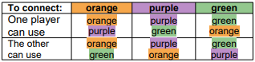
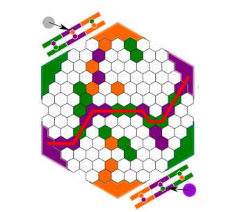
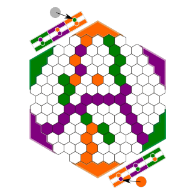
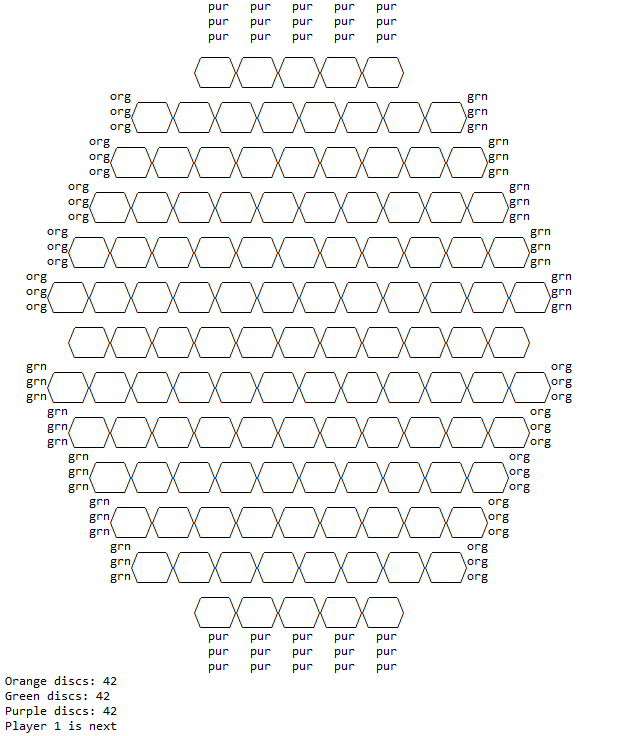
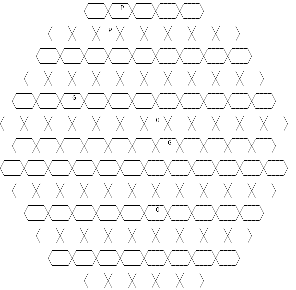
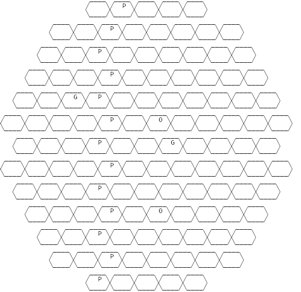

# ***Alliances* - Relatório** 

- **Jogo**: Alliances
- **Grupo**: Alliances_1

| Turma  | Nome                             | Número    |
| -------|----------------------------------| ----------|
| 3      | Davide António Ferreira Castro   | 201806512 |
| 3      | Rui Filipe Mendes Pinto          | 201806441 |

### Intalação e execução ###
Para executar o jogo basta fazer consult ao ficheiro '/src/alliances.pl' no terminal do SICStus Prolog e executar o predicado play/0.

# O Jogo: *Alliances*

 
    O <i>Alliances</i> é um jogo de tabuleiro para dois jogadores. O objetivo do jogo consiste em conectar lados opostos do tabuleiro, que partilhem a mesma cor. Para fazer essa ligação, os jogadores terão de usar a cor respeitante aos lados que estão a conectar, podendo também ter a ajuda da sua cor aliada.

      
    <i>Tabuleiro de Jogo</i>

 

 
    O material necessário para o jogo é um tabuleiro hexagonal, 42 discos verdes, 42 discos laranjas, 42 discos roxos e 2 discos prateados.

 

## Preparação e regras

- Inicialmente, o tabuleiro está vazio e só podem haver 42 discos de cada cor para utilizar. 
- Cada jogador deve ter uma tabela no seu lado, que indica as combinações de cores aliadas possíveis para cada conexão. Esta tabela deve começar sem discos colocados.
- O jogador um inicia a sua jogada, pegando num disco e colocando-o num lugar vazio. O jogador dois executa o mesmo procedimento, e isto repete-se ao longo do jogo.
- Durante o decorrer do jogo, caso um jogador consiga conectar dois lados oposto do tabuleiro (mesma cor), podendo utilizar cores aliadas (como indica a tabela a seguir), o mesmo deverá pegar num disco da cor que completou e colocá-lo sobre a célula correspondente da sua tabela, enquanto que o adversário deverá pegar num disco prateado e colocá-lo igualmente no respetivo lugar da sua tabela (indicando que perdeu essa cor). 

      
    <i>Cores Aliadas</i>  
      
    <i>Cor roxa completada pelo jogador de baixo (cor aliada verde)</i>   

- Se um movimento torna impossível para qualquer jogador conectar uma cor particular (cercando-a), então o jogador adversário bloqueado ganha essa cor.

     
     <i>Cerco à cor laranja permite ao jogador de baixo ganhar a mesma, pois o de cima, com as cores verde e laranja, não consegue completá-la</i>

 

 - Cada cor só poderá ser ganha por um jogador; aquele que alcança a mesma primeiro. No caso de um jogador formar uma conexão para ambos os jogadores, durante uma jogada, a primeira cor completada pertencerá ao jogador que efetuou a jogada.

- Um jogador sagra-se vencedor assim que conseguir completar uma segunda cor.

 

Link para a página de regras do jogo: https://nestorgames.com/rulebooks/ALLIANCES_EN.pdf

# Lógica do Jogo #
## Representação do Estado do Jogo ##

O estado do jogo é representado internamente por dois componentes: 
- uma lista de listas para o tabuleiro, organizada por linhas e diagonais, contendo um átomo em cada célula para indicar o seu estado; 
- um argumento composto com o estado de cor atual para cada jogador ('TRUE' ou 'FALSE'), indicando se o jogador ganhou a cor.

### Átomos ###
**orange** - Peça laranja\
**green** - Peça verde\
**purple** - Peça roxa\
**empty** - Célula sem peça

### Player Atual ###
O player atual é passado por argumento no predicado do ciclo do jogo, que é efetuado recursivamente durante todo o decorrer de uma partida.

### Peças por jogar ###
O número de peças disponíveis para jogar é calculado em cada ciclo de jogo, obtendo-se o número de peças de cada cor já no tabuleiro e subtraindo ao máximo de peças.

#### Estado Inicial ####
>**initial**([
    [                                         empty,    empty],                            
    [                                     empty,   empty,   empty],                         
    [                                empty,    empty,   empty,  empty],                     
    [                           empty,    empty,    empty,   empty,   empty],               
    [                      empty,    empty,    empty,   empty,   empty,   empty],           
    [                          empty,     empty,   empty,   empty,    empty],               
    [                      empty,    empty,    empty,   empty,   empty,   empty],           
    [                 empty,   empty,     empty,   empty,   empty,    empty,   empty],      
    [                      empty,    empty,    empty,   empty,  empty,   empty],           
    [                 empty,   empty,     empty,    empty,   empty,    empty,   empty],      
    [                      empty,    empty,    empty,   empty,  empty,   empty],           
    [                 empty,   empty,     empty,   empty,     empty,    empty,   empty],      
    [                      empty,    empty,    empty,   empty,  empty,   empty],           
    [                 empty,   empty,     empty,   empty,     empty,    empty,   empty],      
    [                      empty,    empty,    empty,   empty,   empty,   empty],           
    [                 empty,   empty,     empty,   empty,     empty,    empty,   empty],      
    [                      empty,    empty,    empty,   empty,   empty,   empty],           
    [                           empty,    empty,   empty,    empty,   empty],               
    [                      empty,    empty,    empty,   empty,   empty,   empty],           
    [                           empty,    empty,   empty,   empty,   empty],                
    [                                empty,    empty,   empty,   empty],                    
    [                                     empty,   empty,   empty],                         
    [                                          empty,   empty]                              
    ]-('FALSE'-'FALSE'-'FALSE'-'FALSE'-'FALSE'-'FALSE')).

 

<!-- #### Estado Intermédio
>**mid**([\
    [nodef, nodef, nodef, nodef, space, purpleEnd, purpleEnd, purpleEnd, purpleEnd, purpleEnd      ],\
    [nodef, nodef, nodef, nodef, space,                          empty, purple, empty, empty, empty                 ],\
    [nodef, nodef, orangeEnd,                          empty, empty, purple, empty, empty, empty, empty, empty,          greenEndSpace],\
    [nodef, nodef, orangeEndSpace,                empty, empty, empty, empty, empty, empty, empty, empty, empty,          greenEndSpace],\
    [nodef, orangeEnd,                          empty, empty, empty, empty, empty, empty, empty, empty, empty, empty,          greenEndSpace],\
    [nodef, orangeEndSpace,                  empty, empty, green, empty, empty, empty, empty, empty, empty, empty, empty,           greenEndSpace],\
    [orangeEnd,                          empty, empty, empty, empty, empty, empty, orange, empty, empty, empty, empty, empty,           greenEndSpace],\
    [nodef, space,                          empty, empty, empty, empty, empty, empty, green, empty, empty, empty, empty                          ],\
    [greenEnd,                           empty, empty, empty, empty, empty, empty, empty, empty, empty, empty, empty, empty,            orangeEndSpace],\
    [nodef, greenEndSpace,                   empty, empty, empty, empty, empty, empty, empty, empty, empty, empty, empty,           orangeEndSpace],\
    [nodef, greenEnd,                           empty, empty, empty, empty, orange, empty, empty, empty, empty, empty,         orangeEndSpace],\
    [nodef, nodef, greenEndSpace,                 empty, empty, empty, empty, empty\, empty, empty, empty, empty,          orangeEndSpace],\
    [nodef, nodef, greenEnd,                           empty, empty, empty, empty, empty, empty, empty, empty,           orangeEndSpace],\
    [nodef, nodef, nodef, nodef, space,                          empty, empty, empty, empty, empty                                     ],\
    [nodef, nodef, nodef, nodef, space, purpleEnd, purpleEnd, purpleEnd, purpleEnd, purpleEnd]\
]).

 

#### Estado Final
>**final**([\
    [nodef, nodef, nodef, nodef, space, purpleEnd, purpleEnd, purpleEnd, purpleEnd, purpleEnd      ],\
    [nodef, nodef, nodef, nodef, space,                          empty, purple, empty, empty, empty                 ],\
    [nodef, nodef, orangeEnd,                          empty, empty, purple, empty, empty, empty, empty, empty,          greenEndSpace],\
    [nodef, nodef, orangeEndSpace,                empty, empty, purple, empty, empty, empty, empty, empty, green,          greenEndSpace],\
    [nodef, orangeEnd,                          empty, empty, empty, purple, empty, empty, empty, empty, green, empty,          greenEndSpace],\
    [nodef, orangeEndSpace,                  empty, empty, green, purple, empty, empty, empty, empty, green, empty, empty,           greenEndSpace],\
    [orangeEnd,                          empty, empty, empty, empty, purple, green, orange, empty, green, empty, empty, empty,           greenEndSpace],\
    [nodef, space,                          empty, empty, empty, purple, empty, empty, green, green, empty, empty, empty                          ],\
    [greenEnd,                           empty, empty, empty, empty, purple, empty, green, green, empty, empty, empty, empty,            orangeEndSpace],\
    [nodef, greenEndSpace,                   empty, empty, empty, purple, empty, green, empty, empty, empty, empty, empty,           orangeEndSpace],\
    [nodef, greenEnd,                           empty, empty, empty, purple, green, orange, empty, empty, empty, empty,         orangeEndSpace],\
    [nodef, nodef, greenEndSpace,                 empty, green, purple, green, empty, empty, empty, empty, empty,           orangeEndSpace],\
    [nodef, nodef, greenEnd,                           green, green, purple, empty, empty, empty, empty, empty,           orangeEndSpace],\
    [nodef, nodef, nodef, nodef, space,                          purple, empty, empty, empty, empty                                     ],\
    [nodef, nodef, nodef, nodef, space, purpleEnd, purpleEnd, purpleEnd, purpleEnd, purpleEnd]\
]).

  

     
    <i>Tabuleiro no Estado Inicial</i>    
     
    <i>Tabuleiro no Estado Intermédio</i>    
     
    <i>Tabuleiro no Estado Final</i>   

 -->

# Visualização do estado de jogo ##
Para visualizar o tabuleiro usamos o predicado display_game/2 que imprime uma linha do tabuleiro (print_line/1) e continua recursivamente até imprimir todas as linhas. 
Através do predicado print_line/1 imprimimos no ecrã cada linha dividida por três partes(print_top, print_mid, print_bot), para conseguirmos as formas dos hexágonos com a letra da cor correspondente no centro. 
Se uma célula conter um átomo de 'end' imprime a cor daquela extremidade; se for 'space' ou 'nodef' imprime espaços completamente vazios(não fazem parte do tabuleiro). Apenas quando contém o código de uma cor válida ou 'empty' imprime o hexágono com o disco correspondente ou vazio.
No final da recursividade são também apresentados os números de discos disponíveis para jogar (display_discs/0) e o número do jogador atual (display_player/1).

>Nota: Para uma correta visualização do jogo as fontes recomendadas a utilizar são a DejaVu Sans Mono (https://www.fontsquirrel.com/fonts/dejavu-sans-mono)  ou Consolas (https://freefontsdownload.net/free-consolas-font-33098.htm).