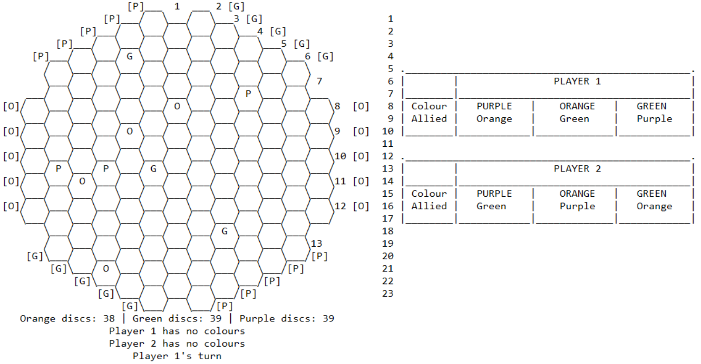
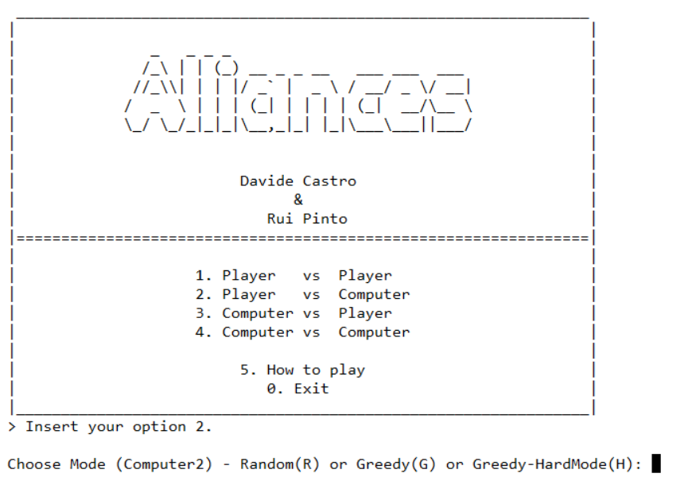

# ***Alliances* - Relatório** 

- **Jogo**: Alliances
- **Grupo**: Alliances_1


| Turma  | Nome                             | Número    |
| -------|----------------------------------| ----------|
| 3      | Davide António Ferreira Castro   | 201806512 |
| 3      | Rui Filipe Mendes Pinto          | 201806441 |

### Intalação e execução ###
Para executar o jogo basta fazer consult ao ficheiro 'src/alliances.pl' no terminal do SICStus Prolog e executar o predicado play/0.


# O Jogo: *Alliances*
<p align="justify"> 
    O <i>Alliances</i> é um jogo de tabuleiro para dois jogadores. O objetivo do jogo consiste em conectar lados opostos do tabuleiro, que partilhem a mesma cor. Para fazer essa ligação, os jogadores terão de usar a cor respeitante aos lados que estão a conectar, podendo também ter a ajuda da sua cor aliada.
</p>

<p align="center">
     <br />
    <i>Tabuleiro de Jogo</i>
</p>

<br />

<p align="justify"> 
    O material necessário para o jogo é um tabuleiro hexagonal, 42 discos verdes, 42 discos laranjas, 42 discos roxos e 2 discos prateados.
</p>

<br />

## Preparação e regras

- Inicialmente, o tabuleiro está vazio e só podem haver 42 discos de cada cor para utilizar. 
- Cada jogador deve ter uma tabela no seu lado, que indica as combinações de cores aliadas possíveis para cada conexão. Esta tabela deve começar sem discos colocados.
- O jogador um inicia a sua jogada, pegando num disco e colocando-o num lugar vazio. O jogador dois executa o mesmo procedimento, e isto repete-se ao longo do jogo.
- Durante o decorrer do jogo, caso um jogador consiga conectar dois lados oposto do tabuleiro (mesma cor), podendo utilizar cores aliadas (como indica a tabela a seguir), o mesmo deverá pegar num disco da cor que completou e colocá-lo sobre a célula correspondente da sua tabela, enquanto que o adversário deverá pegar num disco prateado e colocá-lo igualmente no respetivo lugar da sua tabela (indicando que perdeu essa cor). 


<p align="center">
     <br />
    <i>Cores Aliadas</i><br /><br />
     <br />
    <i>Cor roxa completada pelo jogador de baixo (cor aliada verde)</i> <br /><br />
</p>

- Se um movimento torna impossível para qualquer jogador conectar uma cor particular (cercando-a), então o jogador adversário bloqueado ganha essa cor.

 - Cada cor só poderá ser ganha por um jogador; aquele que alcança a mesma primeiro. No caso de um jogador formar uma conexão para ambos os jogadores, durante uma jogada, a primeira cor completada pertencerá ao jogador que efetuou a jogada.

- Um jogador sagra-se vencedor assim que conseguir completar uma segunda cor.

<br />

Link para a página de regras do jogo: https://nestorgames.com/rulebooks/ALLIANCES_EN.pdf

# Lógica do Jogo #
## Representação do Estado do Jogo ##

O estado do jogo é representado internamente por dois componentes: 
- Uma lista de listas para o tabuleiro, organizada por linhas e diagonais, contendo um átomo em cada célula para indicar o seu estado; 
- Um argumento composto com o estado de cor atual para cada jogador ('TRUE' ou 'FALSE'), indicando se o jogador ganhou a cor.

### Átomos ###
- **orange** - Célula com peça laranja
- **purple** - Célula com peça roxa
- **green**  - Célula com peça verde
- **empty**  - Célula sem peça

### Player Atual ###
O player atual é passado por argumento no predicado do ciclo do jogo, que é efetuado recursivamente durante todo o decorrer de uma partida, alternando os jogadores em cada ciclo.


### Peças por jogar ###
O número de peças disponíveis para jogar é calculado em cada ciclo de jogo, obtendo-se o número de peças de cada cor já no tabuleiro e subtraindo ao máximo de peças.


#### Estado Inicial ####
```
initial([
    [                                         empty,    empty],                            
    [                                     empty,   empty,   empty],                         
    [                                empty,    empty,   empty,   empty],                     
    [                           empty,    empty,    empty,   empty,   empty],               
    [                      empty,    empty,    empty,   empty,   empty,   empty],           
    [                          empty,     empty,   empty,   empty,    empty],               
    [                      empty,    empty,    empty,   empty,   empty,   empty],           
    [                 empty,   empty,     empty,   empty,   empty,    empty,   empty],      
    [                      empty,    empty,    empty,   empty,   empty,   empty],           
    [                 empty,   empty,     empty,    empty,  empty,    empty,   empty],      
    [                      empty,    empty,    empty,   empty,   empty,   empty],           
    [                 empty,   empty,     empty,   empty,   empty,    empty,   empty],      
    [                      empty,    empty,    empty,   empty,   empty,   empty],           
    [                 empty,   empty,     empty,   empty,   empty,    empty,   empty],      
    [                      empty,    empty,    empty,   empty,   empty,   empty],           
    [                 empty,   empty,     empty,   empty,   empty,    empty,   empty],      
    [                      empty,    empty,    empty,   empty,   empty,   empty],           
    [                           empty,    empty,   empty,   empty,    empty],               
    [                      empty,    empty,    empty,   empty,   empty,   empty],           
    [                           empty,    empty,   empty,   empty,    empty],                
    [                                empty,    empty,   empty,   empty],                    
    [                                     empty,   empty,   empty],                         
    [                                          empty,   empty]                              
    ]-('FALSE'-'FALSE'-'FALSE'-'FALSE'-'FALSE'-'FALSE')).
```
<br />

#### Estado Intermédio
```
mid([
    [                                         empty,    empty],                            
    [                                     empty,   empty,    empty],                         
    [                                empty,    empty,   empty,   green],                     
    [                           green,    empty,    empty,   purple,  empty],               
    [                      empty,    green,    empty,   green,   empty,   empty],           
    [                          empty,     purple,   green,   empty,   green],               
    [                      empty,    empty,    green,   empty,   empty,   empty],           
    [                 empty,   empty,     empty,    empty,   empty,   empty,  empty],      
    [                      empty,    empty,    green,   empty,   empty,   empty],           
    [                 empty,   empty,     empty,    empty,   empty,   empty,  empty],      
    [                      empty,    empty,    green,   empty,   empty,   empty],           
    [                 empty,   empty,     empty,    empty,   empty,   empty,  empty],      
    [                      empty,    empty,    purple,  empty,   empty,   empty],           
    [                 empty,   empty,     empty,    empty,   empty,   empty,  empty],      
    [                      empty,    empty,    purple,  empty,   purple,  empty],           
    [                 empty,   empty,     empty,    empty,   empty,   empty,  empty],      
    [                      empty,    empty,    green,   empty,   empty,   empty],           
    [                           empty,    empty,    empty,   empty,   empty],               
    [                      empty,    empty,    purple,  empty,   empty,   empty],           
    [                           empty,    empty,    empty,   empty,   empty],                
    [                                empty,    green,   empty,   empty],                    
    [                                     purple,   green,   empty],                         
    [                                          empty,   green]                              
    ]-('FALSE'-'FALSE'-'TRUE'-'TRUE'-'FALSE'-'FALSE')).
```
<br />

#### Estado Final
```
final([
    [                                          empty,   empty],                            
    [                                     empty,   empty,   empty],                         
    [                                empty,    empty,   empty,   green],                     
    [                          green,    green,    empty,   purple,   empty],               
    [                      orange,   green,    green,   green,   empty,   empty],           
    [                          empty,     purple,  green,   empty,    green],               
    [                      orange,   empty,    green,   green,   orange,  green],           
    [                 green,   empty,     empty,   empty,   orange,   empty,   green],      
    [                      empty,    empty,    green,   empty,   empty,   empty],           
    [                 empty,   empty,     empty,   empty,   empty,    empty,   empty],      
    [                      empty,    empty,    green,   empty,   empty,   empty],           
    [                 empty,   empty,     empty,   empty,   empty,    empty,   empty],      
    [                      empty,    orange,   purple,  empty,   empty,   empty],           
    [                 purple,  orange,    empty,   empty,   empty,    empty,   orange],      
    [                      empty,    empty,    purple,  purple,  purple,  orange],           
    [                 empty,   empty,     empty,   empty,   empty,    empty,   empty],      
    [                      empty,    empty,    green,   empty,   empty,   empty],           
    [                          empty,     empty,   green,   empty,    empty],               
    [                      empty,    empty,    purple,  empty,   empty,   empty],           
    [                          empty,     empty,   empty,   empty,    empty],                
    [                                empty,    green,   empty,   empty],                    
    [                                     purple,  green,   empty],                         
    [                                          empty,   green]                              
    ]-('FALSE'-'TRUE'-'TRUE'-'TRUE'-'FALSE'-'FALSE')).
```
<br>

# Visualização do estado de jogo ##
Para visualizar o tabuleiro usamos o predicado **display_game/2**, recebendo o estado do jogo e o player atual.
Este predicado chama **print_board/2**, **display_discs/1**, **display_player/1** e **displayColoursState/1**, que imprimem o tabuleiro, o número de discos disponíveis, o jogador do turno seguinte e as cores ganhas de cada jogador, respetivamente. 
Através do predicado print_line/2, usado em print_board, imprimimos no ecrã cada linha dividida por três casos (print_case1, print_case2, print_case3) para conseguirmos as formas dos hexágonos com a letra da cor correspondente no centro. Adicionalmente, consideramos também dois casos específicos para a primeira e última linhas do tabuleiro.
 
 ```prolog
 % Imprime toda a informação do jogo - Caso em que o jogo foi ganho
display_game(Board-ColoursWon, 0) :-
    print_board(Board, 1),
    display_discs(Board-ColoursWon).

% Imprime toda a informação do jogo - Incluindo o próximo player a jogar
display_game(Board-ColoursWon, Player) :-
    print_board(Board, 1),
    display_discs(Board-ColoursWon),
    display_player(Player).
```

Junto com o tabuleiro, o jogador atual, o estado das cores e dos discos, é também imprimido do lado direito do tabuleiro, a tabela de cores para cada jogador, para estes consultarem as suas cores aliadas.



Antes do decorrer da partida, é também apresentado um sistema de menus ao utilizador, onde pode consultar instruções sobre o jogo, escolher o modo de jogo e, para os modos com computador, escolher o seu nível de dificuldade.




>Nota: Para uma correta visualização do jogo as fontes recomendadas a utilizar são a DejaVu Sans Mono (https://www.fontsquirrel.com/fonts/dejavu-sans-mono)  ou Consolas (https://freefontsdownload.net/free-consolas-font-33098.htm).

<br>

## Lista de Jogadas Válidas ##

Uma jogada é considerada válida quando a célula de destino está vazia, ou seja, ainda não contém qualquer peça. A lista de jogadas válidas é obtida a partir do predicado valid_moves/2, que verifica se a condição referida anteriormente está satisfeita e, se existem discos disponíveis para efetuar cada jogada.
É usado um *findall* para construir a lista de todas as jogadas que obedecem a todas as condições.

```prolog
valid_moves(Board-ColoursWon, ListOfMoves) :-
    searchBoard(Board, [], List, 1),
    findall(Move, 
        (
            member(Move, List), 
            checkValidMove(Board-ColoursWon, Move)
        ), 
    ListOfMoves).
```

**searchBoard** - Dado o tabuleiro do jogo, unifica com o seu 3º argumento uma lista contendo todos os movimentos possíveis inicialmente, cada um na forma [Linha, Diagonal, Cor].

**checkValidMove** - Dada uma jogada possível (Linha, Diagonal, Cor), verifica se a célula alvo está vazia e se existem discos suficientes da sua "Cor" para efetuar a mesma.

<br>

## Execução de Jogadas ##

Durante cada turno, o jogador tem que fazer apenas uma jogada, que consiste em colocar um disco de qualquer cor, de entre as três disponíveis, em qualquer casa que estiver atualmente vazia.

Inicialmente, em cada jogada, é chamado o predicado **userPlay/4**, onde é inserido o *input* relativo à jogada (predicado **getUserInput/3**) e verificado se as coordenadas inseridas pelo jogador são válidas, para o conjunto Linha + Diagonal + Cor. No caso desta condição ser satisfeita, é utilizado o predicado **move(+GameState, +Move, -NewGameStateBoard)**, que após verificação se as coordenadas fornecidas equivalem a uma célula válida, atualiza o tabuleiro, substituindo a célula que anteriormente estava vazia pela cor da jogada efetuada. Por fim, no predicado **updateColours/3**, é verificado se a jogada contribuiu para que o jogador completasse uma cor. Nesse caso, o *GameState* é alterado, passando a **TRUE** o estado da cor ganha que antes estava a **FALSE**, por ainda não ter sido obtida. Por fim, é imprimida a jogada efetuada através do predicado **print_move/1**. Todo o predicado **userPlay** está envolvido num *repeat* para no caso de existirem erros nos *inputs* fornecidos pelo jogador, voltar-se atrás e pedir-se nova inserção dos mesmos.

```prolog
userPlay(GameState, NewGameState, Nplayer-p) :-
    repeat,
    (
        getUserInput(Row, Diagonal, Colour),
        move(GameState, [Row, Diagonal, Colour], NewGameStateBoard),
        updateColours(NewGameStateBoard, NewGameState, Nplayer),
        print_move([Row, Diagonal, Colour])
    ).
```

## Final do Jogo ##

O predicado **game_over(+GameState, -Winner)** é responsável pela verificação do término do jogo.  Em *GameState* recebe entre outras coisas, o estado das cores do respetivo jogador e verifica se pelo menos duas foram ganhas, no predicado **checkPlayerWinner/1**. Caso o mesmo suceda, significa que o jogador ganhou sendo portanto retornado em *Winner* e o jogo termina.

```prolog
game_over(_-(Purple-Orange-Green-_-_-_), Winner) :-
    checkPlayerWinner(Purple-Orange-Green),
    Winner is 1.

game_over(_-(_-_-_-Purple-Orange-Green), Winner) :-
    checkPlayerWinner(Purple-Orange-Green),
    Winner is 2.

checkPlayerWinner('TRUE'-'TRUE'-_).
checkPlayerWinner('TRUE'-_-'TRUE').
checkPlayerWinner(_-'TRUE'-'TRUE').
```

> Programação declarativa utilizada no caso do jogador 1 e 2.

<br>

## Avaliação do Tabuleiro ##

O predicado utilizado na avaliação do tabuleiro é o **value(+GameState, +Player, -Value)**. O mesmo retorna em *Value*, o valor do tabuleiro para um dado *Player*. Quanto maior o *Value*, mais favorável o estado do tabuleiro para o jogador atual. 

```prolog
value(GameState, Player, Value) :-
    findall(ColourTable, colourTable(Player, ColourTable), ColourTables),
    findall(ValueColour, ( member(Colour2-_-NotAlliedColour2, ColourTables), 
        getDistanceColour(GameState, Colour2-NotAlliedColour2, ValueColour1), transformValue(ValueColour1, ValueColour)), 
        ValueColours),
    sumlist(ValueColours, Value).
```

Primeiramente, obtém-se a tabela de cores para o player atual, na forma Cor-CorAliada-CorNaoAliada. Conseguimos então, com essa tabela, a cor não aliada do jogador para cada cor. Para obter todas as tabelas é usado um *findall*, que verifica as tabelas para esse player e cria uma lista ColourTables, contendo-as. 

De seguida, avaliamos o tabuleiro considerando cada uma das cores. Neste caso, usamos o predicado **getDistanceColour(+GameState, +ColourAndNotAllied, -Distance)**, que calcula a distância a que o jogador está de ligar a cor recebida, unificando-a em *Distance*.

```prolog
getDistanceColour(Board-ColourState, Colour-NotAlliedColour, Distance) :-  
    getColourStartingPoints(Colour, ColourState, StartPoints, Predicate),
    max_depth(MaxDepth),
    getDistance(StartPoints, [], NotAlliedColour, MaxDepth, 0, Distance, Board, Predicate), !.
```

Neste predicado, é usado o **getColourStartingPoints(+Colour, +ColourState, -StartPoints, -EndPredicate)**, que, recebendo a cor e o estado das cores, unifica em StartPoints uma lista com os pontos de uma das bordas da cor pretendida, e em EndPredicate o nome do predicado que sucede nos pontos da borda oposta. Por exemplo, para a cor 'orange' são retornados os pontos da borda 'orange1' e EndPredicate é unificado com 'orange2'.

```prolog
getColourStartingPoints(purple, 'FALSE'-_-_, StartPoints, purple2) :-
    findall(Row-Diagonal, purple1(Row, Diagonal), StartPoints).
    
getColourStartingPoints(orange, _-'FALSE'-_, StartPoints, orange2) :-
    findall(Row-Diagonal, orange1(Row, Diagonal), StartPoints).

getColourStartingPoints(green, _-_-'FALSE', StartPoints, green2) :-
    findall(Row-Diagonal, green1(Row, Diagonal), StartPoints).
```

De seguida, usando a profundidade máxima definida no programa, executa-se **getDistance/8**, que, no código acima, devolve em *Distance* a distância para fazer a cor que tem uma borda em *StartPoint* e a outra na borda com nome *Predicate*. A distância é avaliada da seguinte forma:

Num algoritmo da espécie pesquisa em largura, faz-se uma contagem dos níveis necessários para fazer um caminho entre as bordas opostas, sendo que células com a cor pretendida e a cor aliada não aumentam a contagem. Assim obtém-se o número mínimo de peças a colocar para o jogador ligar a cor. Se a cor estiver bloqueada, o predicado retorna uma distância 'infinita' definida no programa.

No final, a distância é transformada num valor que beneficia distâncias menores em *transform_value/2*, neste caso 1/(Distância^3), e, obtendo-se a lista com a distância para cada cor, somam-se os elementos. Assim, consegue-se a avaliação do estado de jogo atual.

<br>

## Jogada do Computador ##

Nos modos que incluem um jogador de inteligência artifical, este pode ser definido com três modos de dificuldade diferentes:
- Aleatório
- Ganancioso Fácil
- Ganancioso Difícil

Para estes modos, foi criado o predicado **choose_move(+GameState, +Player, +Level, -Move)**, sendo que *Level* pode ser um dos seguintes átomos: *random*, *greedy* ou *greedy_hard*.
```prolog
choose_move(GameState, Player, Level, Move) :-
    valid_moves(GameState, ListOfMoves),
    getMove(GameState, Level, ListOfMoves, Move, Player).
```
Obtendo a lista de todas as jogadas válidas (*valid_moves/3*), é então possível escolher qual a jogada melhor para o jogador através de **getMove(+GameState, +Level, +ListOfMoves, -Move, +Player)**.

Nesse predicado, são gerados todos os tabuleiros possíveis a partir da lista de jogadas, e cada um deles é avaliado com recurso ao predicado *value/3*. É então selecionado a jogada com o valor máximo e, no caso de múltiplas jogadas com esse valor máximo, uma delas é selecionada aleatoriamente.

No entanto, este predicado varia de acordo com o modo de dificuldade:
- No ganancioso fácil, é efetuado o caso acima normalmente
- No ganancioso difícil, o valor de cada jogada torna-se no valor do tabuleiro para o inimigo subtraído ao valor do tabuleiro para o jogador atual, seguindo uma proporção definida
- No modo aleatório, basta selecionar um elemento *random* da lista e unificar com *Move*

No modo aleatório, é também efetuado um *sleep* de 2 segundos, devido à velocidade da escolha de movimento.

<br>

# Conclusão #

Este projeto, realizado no âmbito da Unidade Curricular de Programação em Lógica, teve como objetivo a criação de um jogo de tabuleiro em *Prolog*. Após o desenvolvimento do mesmo, constatamos que foi de facto um projeto desafiante, uma vez que o algoritmo de *path finding* utilizado no cálculo da melhor jogada para os modos *greedy* e *greedy hard*, bem como o desenho do tabuleiro no terminal em formato de malha, trouxeram-nos muitos problemas que foram mais tarde foram ultrapassados. 

O resultado final foi uma implementação robusta e passível de transposições para aplicações gráficas 3D mais complexas.
Uma possível melhoria relativamente ao projeto, seria o desenvolvimento de um algoritmo de escolha de jogada do computador que tornasse impossível ao adversário ganhar o jogo.
    
# Bibliografia #

Página de regras do jogo Alliances - https://nestorgames.com/rulebooks/ALLIANCES_EN.pdf

Documentação de bibliotecas do Prolog - https://www.swi-prolog.org/

Questões sobre pesquisa em largura em Prolog - https://stackoverflow.com/questions/34082799/breadth-first-search-in-prolog